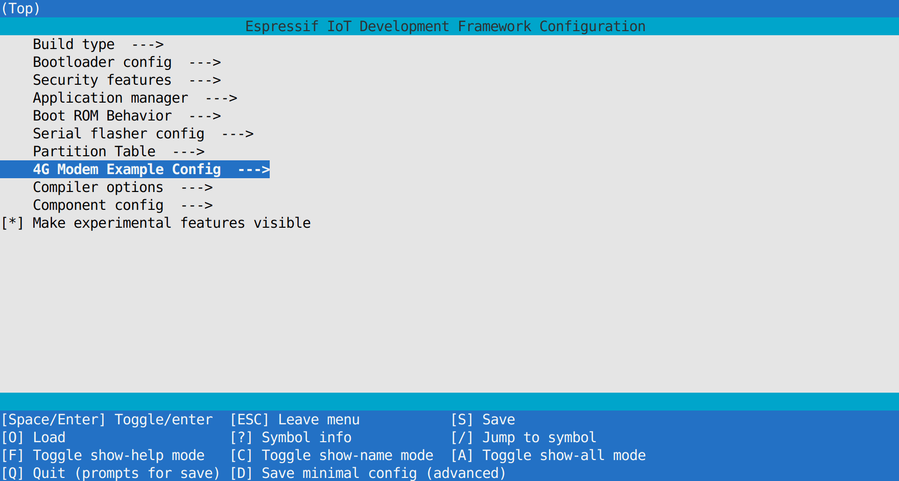
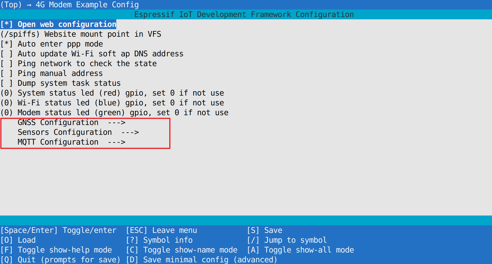
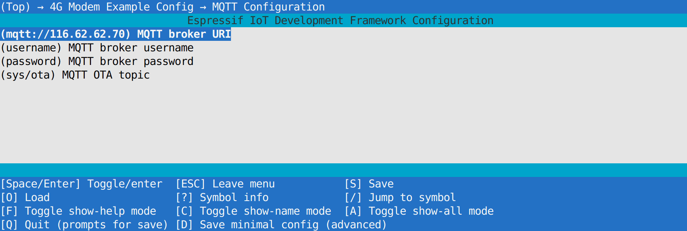
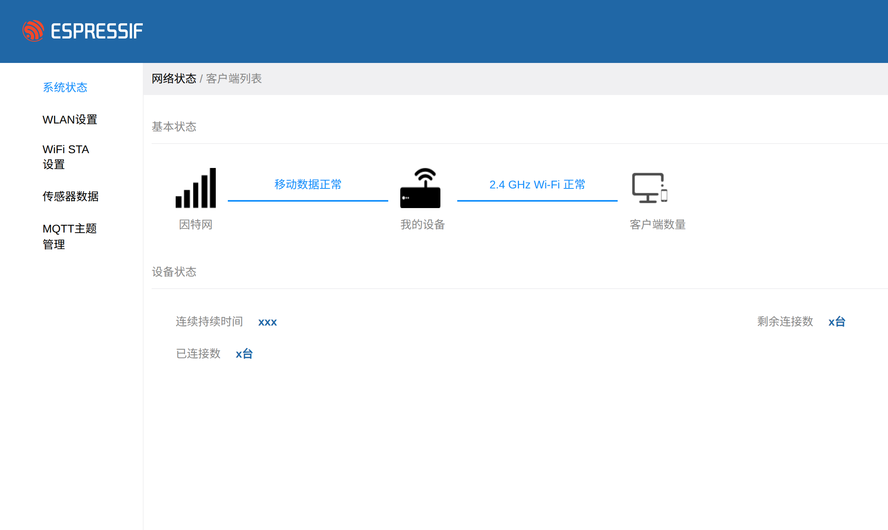
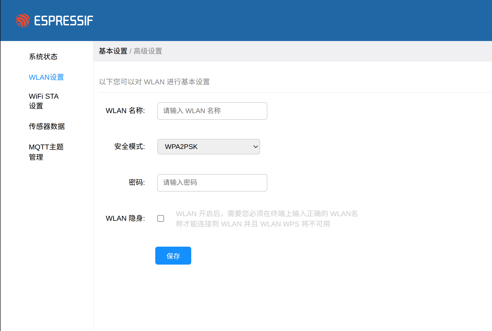
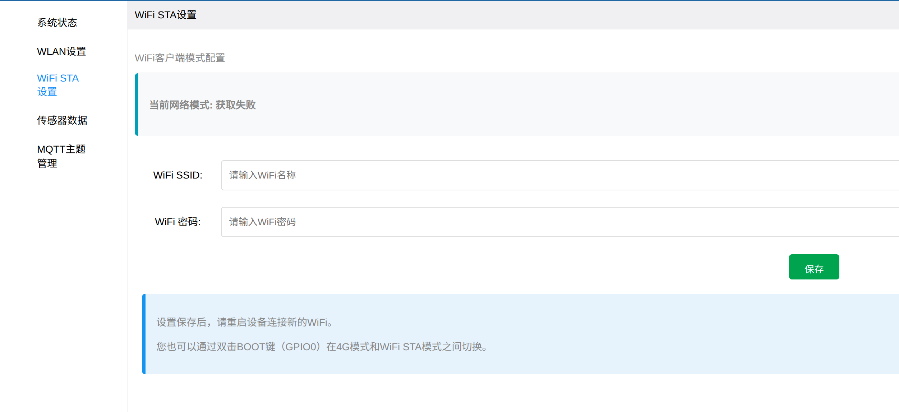
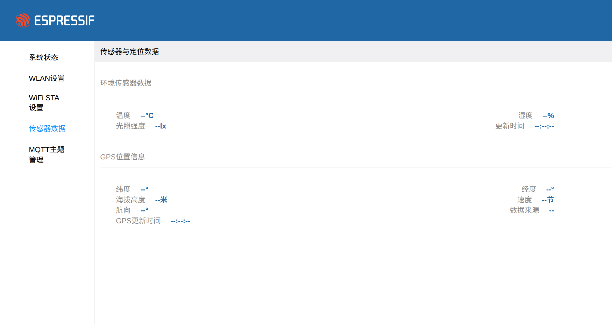
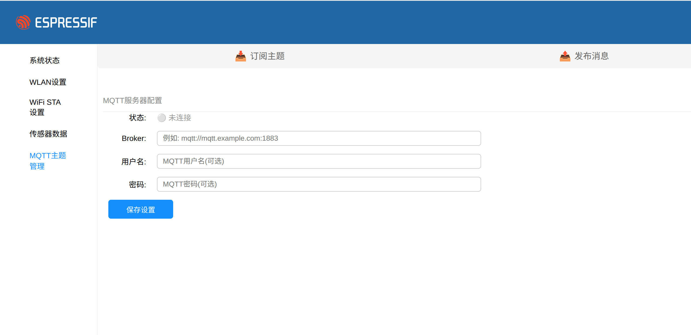
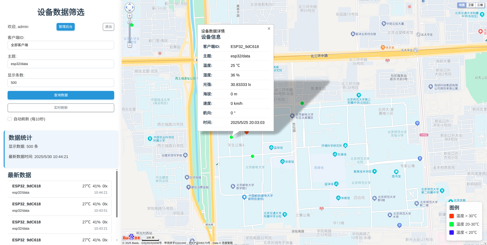

# ESP32-MQTT 全功能物联网网关项目

## 1. 项目概述与架构

`esp32-mqtt` 是一个基于乐鑫 ESP32-S3 的、功能全面且高度模块化的物联网网关项目。它超越了简单的 MQTT 数据采集上报工具的范畴，是一个集成了多种网络模式、网页远程配置、数据路由和远程固件升级功能于一体的综合性解决方案。

### 1.1 核心功能亮点

*   **双网络模式与无缝切换**：支持 **4G LTE** 和 **Wi-Fi** 两种方式接入互联网。用户可通过**双击BOOT键**在两种模式间动态切换，选择的模式会被持久化存储，重启后依然生效。
*   **集成网络网关 (Router)**：无论是 4G 还是 Wi-Fi 模式，设备本身都会创建一个 Wi-Fi AP 热点。通过 ESP-IDF 的 NAPT（网络地址端口转换）功能，连接到此 AP 的任何设备（如手机、笔记本电脑）都可以共享主控的网络连接来访问互联网。这使得设备可以充当一个便携式 4G 路由器或 Wi-Fi 中继器。
*   **全功能 Web 配置界面**：设备启动后，用户无需安装任何 App，只需连接其创建的 Wi-Fi AP，即可通过浏览器访问内置的 Web 服务器。此配置界面允许用户：
    *   扫描并配置需要连接的外部 Wi-Fi 的 SSID 和密码。
    *   灵活配置 MQTT Broker 的地址、端口、用户名、密码等连接参数。
    *   动态地添加或删除需要订阅的 MQTT 主题。
    *   实时查看从传感器和 GPS 模块采集的最新数据。
    *   通过 Web 界面直接向指定主题发布 MQTT 消息，方便远程调试。
*   **丰富的数据采集与处理**：项目集成了多种传感器（如温湿度、光照）和 GPS 模块，可将环境数据和地理位置信息进行统一采集。GPS 数据在采集后会从原始的 NMEA 格式转换为更通用的十进制度格式再进行上报。
*   **强大的 MQTT 功能**：设备通过 MQTT 连接到云平台，除了周期性上报 JSON 格式的遥测数据，还订阅特定主题以接收远程指令，例如通过一条包含固件 URL 的 MQTT 消息来触发 OTA (Over-The-Air) 固件升级。
*   **高内聚低耦合的模块化设计**：项目代码结构清晰，功能高度模块化。每个模块（如网络、数据、MQTT、HTTP）职责分明，通过定义良好的接口和事件进行通信，极大地提高了代码的可读性、可维护性和可扩展性。

### 1.2 系统架构

项目的架构可以分为以下几个层次：

1.  **硬件抽象层**：直接与硬件交互的驱动代码，例如控制 4G 模组的 AT 指令、I2C/GPIO 传感器驱动、UART GPS 驱动等。
2.  **功能模块层**：基于硬件抽象层，封装出具体的功能模块，如 `network_manager`、`mqtt_client`、`http_server`、`data_manager` 等。这是项目的核心业务逻辑所在。
3.  **应用层**：`app_main.c` 作为顶层应用，负责初始化并协调所有功能模块，启动 FreeRTOS 任务，将整个系统"粘合"在一起。
4.  **人机交互层**：通过 `http_server` 提供的 Web 界面，以及 `network_manager` 提供的物理按键，用户可以与设备进行交互和配置。

### 1.3 项目文件结构

```
esp32-mqtt/
├── main/
│   ├── 4g/                 # 4G模组控制
│   ├── data_manager/       # 数据模型与JSON序列化
│   ├── gps/                # GPS数据采集与解析 (AT指令方式)
│   ├── http_server/        # Web服务器与API接口
│   ├── mqtt_client/        # MQTT客户端与云端通信
│   ├── network_manager/    # 网络模式管理 (4G/WiFi切换)
│   ├── OTA/                # OTA固件升级
│   ├── rgb_led/            # RGB LED状态指示
│   ├── sensors/            # 传感器数据采集
│   ├── time/               # NTP时间同步
│   ├── app_main.c          # 主应用程序入口
│   └── CMakeLists.txt
├── spiffs/
│   ├── css/                # CSS样式文件
│   ├── img/                # 图片资源
│   ├── js/                 # JavaScript前端逻辑
│   ├── index.html          # 各功能页面的HTML文件
│   └── ...
├── partitions.csv          # 分区表定义
├── sdkconfig               # 项目配置文件 (menuconfig生成)
└── CMakeLists.txt          # 顶层CMake文件
```


---
## 编译、烧录与使用指南

本项目使用 ESP-IDF 进行开发，官方推荐使用 Docker 来保证编译环境的一致性，避免因本地环境配置问题（如Python版本、依赖库冲突）导致的编译失败。

### 步骤 1: 安装 Docker

请根据你的操作系统（Windows, macOS, or Linux）从 Docker 官方网站下载并安装 Docker Desktop 或 Docker Engine。

*   **官方网站**: [https://www.docker.com/products/docker-desktop/](https://www.docker.com/products/docker-desktop/)
*   **验证安装**: 安装完成后，在终端输入 `docker --version`，如果能看到版本号，则表示安装成功。

### 步骤 2: 拉取 ESP-IDF Docker 镜像

打开你的终端或命令行工具，执行以下命令来拉取乐鑫官方的、包含了所有工具链的 ESP-IDF Docker 镜像。

```bash
docker pull espressif/idf:v5.4.1
```
> **版本注意**: 本项目使用的 API（如 `esp_netif_napt_enable`）在 ESP-IDF 的不同主版本间可能有差异。代码库中使用了 v5.x 的 API，因此推荐使用 `v5.4.1` 或更新的 `v5.x` 版本镜像以保证兼容性。

### 步骤 3: 运行 Docker 容器

在终端中，首先 `cd` 到你的项目根目录 (即 `esp32-mqtt/` 所在的位置)，然后运行以下命令来启动一个容器，并将你的项目目录挂载进去。

**对于 Linux / macOS:**
```bash
docker run --rm -v $PWD:/project -w /project --device=/dev/ttyUSB0 -it espressif/idf:v5.4.1
```
**对于 Windows (PowerShell):**
```powershell
docker run --rm -v ${PWD}:/project -w /project --device=\\.\COM3 -it espressif/idf:v5.4.1
```

**命令参数详解:**
*   `--rm`: 容器退出后自动删除，保持系统干净。
*   `-v $PWD:/project` (或 `-v ${PWD}:/project`): **核心参数**。它将你当前所在的目录（Host OS 的 `$PWD`）挂载到容器内的 `/project` 目录。这意味着你在容器内对 `/project` 目录的任何修改，都会**实时同步**到你本地的项目文件。
*   `-w /project`: 设置容器的默认工作目录为 `/project`，这样你一进入容器就在项目根目录下了。
*   `--device=/dev/ttyUSB0` (或 `\\.\COM3`): **核心参数**。将主机的串口设备暴露给容器，这样容器内的 `idf.py` 才能找到并向开发板烧录。**请务必将 `/dev/ttyUSB0` 或 `COM3` 替换为你自己电脑上实际的 ESP32 串口号**。
*   `-it`: 以交互模式进入容器，为你提供一个可以输入命令的 shell。
*   `espressif/idf:v5.4.1`: 你要使用的 Docker 镜像。

成功执行后，你的终端提示符会变成类似 `root@xxxxxxxxx:/project#` 的样子，表明你已经**在 Docker 容器的 shell 环境中**了。

### 步骤 4: 配置项目 (`menuconfig`)

在容器的 shell 中，首先需要告诉 ESP-IDF 你的目标芯片型号。本项目基于 ESP32-S3。

```bash
idf.py set-target esp32s3
```

然后，运行图形化配置工具 `menuconfig` 来配置项目的所有参数。

```bash
idf.py menuconfig
```

在 `menuconfig` 蓝色界面中，使用方向键导航，回车键进入，`Y`/`N` 键选择，`?` 键查看帮助。你需要检查或配置以下关键选项：

*   **(可选) 4G 模组配置**:
    *   路径: `Component config` -> `4G Cat.1 Module` -> `Select 4G Module`
    *   说明: 根据你使用的具体 4G 模块型号进行选择。

*   **MQTT 默认配置**:
    *   路径: `Component config` -> `ESP-MQTT`
    *   `Broker URL`: 设置你自己的 MQTT Broker 默认地址 (e.g., `mqtts://your-broker.com`)。
    *   `Broker Certification`: 如果使用 MQTTS (加密连接)，需要将 CA 证书内容嵌入固件。
    *   `Username`, `Password`: 配置连接 Broker 所需的默认用户名和密码。
    *   `OTA Firmware Upgrade Topic`: 配置用于接收 OTA 指令的特定主题。
    *   说明: 这些是在设备 NVS 中没有用户配置时的出厂默认值。

*   **GNSS 模块 UART 配置**:
    *   路径: `Component config` -> `GNSS Module`
    *   `GNSS UART TX Pin`, `GNSS UART RX Pin`: 根据你的硬件电路图，修改与 4G/GNSS 模组通信的 UART 引脚号。

*   **RGB LED GPIO 配置**:
    *   路径: `Component config` -> `LED Strip`
    *   `RMT GPIO for WS2812/SK6812 strip`: 配置用于驱动 WS2812 类型 RGB LED 的 GPIO 引脚。





完成所有配置后，按 `S` 键保存，然后按 `Q` 键退出。

### 步骤 5: 编译项目

在容器的 shell 中，执行编译命令：

```bash
idf.py build
```
这会调用 ESP-IDF 的 CMake 构建系统，编译项目的所有源文件和组件。首次编译时间较长。如果一切顺利，你会在项目根目录下的 `build` 文件夹里看到生成的 `.bin` 固件文件和 `partition-table.bin` 分区表文件等。

### 步骤 6: 烧录与监视

保持在容器的 shell 中，用 USB 线连接你的 ESP32-S3 开发板到电脑。然后执行以下命令来**一键完成烧录固件、分区表和启动加载程序，并自动打开串口监视器**。

```bash
idf.py flash monitor
```
> 如果上一步 `docker run` 时没有加 `-p` 参数指定串口，此处也可以临时指定：`idf.py -p /dev/ttyUSB0 flash monitor`。

烧录完成后，`monitor` 会自动启动，你将看到设备的启动日志、各模块的初始化信息以及传感器读数等。

### 步骤 7: 使用与测试

1.  **连接 AP**: 设备启动后，会创建一个名为 `ESP32-S3-XXXX` 的 Wi-Fi AP。用你的手机或电脑连接它。
2.  **访问 Web 界面**: 连接成功后，打开浏览器，访问 `http://192.168.4.1` (这是 ESP32 SoftAP 的默认网关地址)。
3.  **配置 Wi-Fi**: 在 `WLAN` 或 `Wi-Fi STA` 页面，输入你要连接的外部路由器的 SSID 和密码，点击保存。设备会自动重启并尝试连接。
4.  **配置 MQTT**: 设备连接到外部网络后，再次访问 Web 界面，进入 `MQTT` 配置页面，填入你的 Broker 信息和需要订阅的主题，保存。
5.  **验证数据**:
    *   在 Web 界面的 `Sensors` 或 `Status` 页面，你应该能看到实时更新的传感器和 GPS 数据。
    *   使用一个 MQTT 客户端工具（如 MQTTX）连接到同一个 Broker，订阅你配置的上报主题，你应该能收到设备发送的 JSON 数据。
    *   通过 MQTTX 向 OTA 主题发布一条指令（格式见`ota.c`），观察设备日志，看它是否开始下载并执行 OTA 升级。

### 故障排除 (Troubleshooting)

*   **`idf.py: command not found`**: 你不在 Docker 容器的 shell 中。请确保你已经通过 `docker run` 命令成功进入了容器。
*   **`Serial port /dev/ttyUSB0 not found`**:
    1.  确认你的 ESP32 开发板已正确连接到电脑。
    2.  确认 `/dev/ttyUSB0` 是正确的串口号（在 Linux 中可使用 `ls /dev/tty*` 查看，在 macOS 中是 `/dev/cu.usbserial-*`）。
    3.  确认你在 `docker run` 命令中使用了正确的 `--device` 参数将串口传递给了容器。
*   **Web 界面无法访问**:
    1.  确认你的确连接到了 ESP32 创建的 AP。
    2.  确认你访问的地址是 `http://192.168.4.1`。
    3.  检查设备串口日志，看 `http_server` 模块是否成功启动，有无报错信息。
*   **MQTT 连接失败**:
    1.  在 Web 界面的 MQTT 状态部分查看具体的错误信息（如认证失败、服务器不可达）。
    2.  检查设备串口日志，`mqtt_client` 模块会打印详细的连接错误原因。
    3.  确保 Broker 地址、端口、用户名/密码完全正确，且你的设备所在网络可以访问到该 Broker。

---

## 自定义与扩展

本章节提供一些二次开发的思路和指导。

### 如何添加一个新的传感器

假设我们要添加一个通过 I2C 连接的 AHT20 温湿度传感器。

1.  **添加驱动组件**: 将 AHT20 的驱动文件（如 `aht20.c`, `aht20.h`）作为一个组件添加到项目中。
2.  **修改 `sensors` 模块**:
    *   在 `sensors.c` 的 `sensors_init` 函数中，增加 AHT20 的初始化代码。
    *   在 `sensors.c` 中添加一个新的函数 `read_aht20_data(float *temp, float *humi)`。
    *   修改 `sensors_task`，在循环中调用 `read_aht20_data`。
3.  **修改 `data_model`**:
    *   在 `data_model.h` 的 `sensor_data_t` 结构体中，增加两个 `float` 成员 `aht20_temp` 和 `aht20_humi`。
    *   修改 `data_model_update_sensor_data` 函数，增加两个参数来接收 AHT20 的数据并更新到模型中。
4.  **修改 `json_wrapper`**:
    *   在 `json_generate_from_data_model` 函数中，增加几行代码，将 `aht20_temp` 和 `aht20_humi` 序列化到 `sensors` JSON 对象中。
5.  **修改前端**:
    *   打开 `sensors.html` 或其他你希望显示数据的地方。
    *   增加两个 `<span>` 或 `<div>` 元素，并给它们ID，如 `aht20-temp-value`。
    *   修改对应的 JavaScript 文件（如 `sensors.js`），在获取并解析后端 `/api/sensors/data` 返回的 JSON 后，找到新的数据点 (`data.sensors.aht20_temp`)，并将其更新到新增的 HTML 元素中。

### 如何添加一个新的网页和API

假设要增加一个"设备信息"页面。

1.  **创建前端页面**: 在 `spiffs` 目录下新建 `device_info.html`，并可以为其创建 `spiffs/js/device_info.js`。
2.  **添加后端API**:
    *   在 `http_server/modem_http_config.c` 中，编写一个新的处理函数 `device_info_get_handler`。
    *   此函数从 `data_model` 获取设备ID、固件版本等信息，并使用 `cJSON` 或 `json_generator` 将其打包成 JSON。
    *   创建一个新的 `httpd_uri_t` 结构，将路径 `/api/device/info` 与 `device_info_get_handler` 绑定。
    *   在 `start_webserver` 函数中注册这个新的 URI。
3.  **连接前后端**:
    *   在 `device_info.js` 中，使用 `Ajax.get` 方法向 `/api/device/info` 发起请求。
    *   在回调函数中，解析返回的 JSON，并将数据显示在 `device_info.html` 页面的相应元素中。
4.  **添加入口**: 在 `spiffs/` 所有 HTML 文件共用的左侧菜单栏部分，添上一个指向 `device_info.html` 的链接。

通过以上步骤，你就成功地为项目增加了一个全新的功能页面。 


---
## 项目内容展示

### httpserver








### webserver

